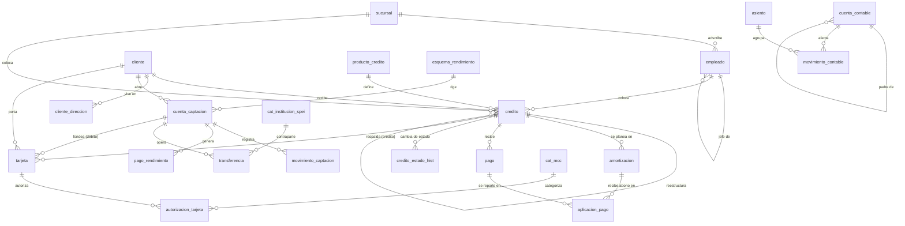
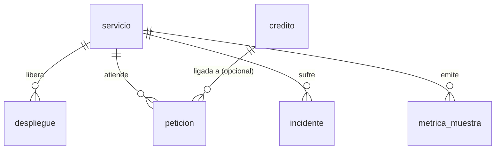

# Modelo de datos

Hay tres esquemas:

- **`core`**: el negocio bancario. Casi todo el currículum vive aquí.
- **`ops`**: telemetría del sistema (peticiones, despliegues, incidentes, métricas). Módulo avanzado y opcional.
- **`lab`**: infraestructura del laboratorio (catálogo de ejercicios, intentos, verificación). No es parte del dominio.

Los comentarios de cada tabla y columna son la referencia del diccionario. En `psql`, `\d+ core.credito` (o cualquier tabla) los muestra sin salir de la terminal. Este documento explica la forma del modelo y **por qué** está así.

## Diagrama entidad-relación del esquema `core`

`tasa_referencia` (TIIE diaria) no tiene llaves foráneas: es una serie temporal independiente.

## Diagrama entidad-relación del esquema `ops`

El enlace `peticion.credito_id` es el puente entre negocio y sistema: permite preguntar, por ejemplo, si los desembolsos fallidos coinciden con un despliegue o con latencia alta (módulo 7).

## Catálogo de tablas

### `core`
| Tabla | Qué guarda |
|---|---|
| `sucursal` | Sucursales. Una está cerrada y otra no colocó ningún crédito (a propósito). |
| `empleado` | Asesores y su cadena de mando (`jefe_id` se auto-referencia). |
| `cliente` | Personas. `ingreso_mensual` y `rfc` pueden ser NULL a propósito. |
| `cliente_direccion` | Domicilios (1:N). Un cliente puede tener 0, 1 o varios. |
| `producto_credito` | Catálogo de productos con tasa, plazo, monto y comisión. |
| `credito` | Créditos otorgados: la cabecera del préstamo. |
| `amortizacion` | Plan de pagos **planeado** (sistema francés). La tabla más grande. |
| `pago` | Pagos **recibidos**: parciales, anticipados, duplicados. |
| `aplicacion_pago` | Cómo se repartió cada pago entre cuotas (N:M). |
| `credito_estado_hist` | Historial temporal de estados, sin traslapes. |
| `esquema_rendimiento` | Configuración de rendimientos de captación. |
| `cuenta_captacion` | Cuentas de ahorro y plazo (con CLABE). |
| `movimiento_captacion` | Depósitos y retiros. |
| `pago_rendimiento` | Pago de rendimientos con retención de ISR. |
| `cat_institucion_spei` | Bancos participantes en SPEI. |
| `cat_mcc` | Códigos de giro de comercio. |
| `transferencia` | Transferencias SPEI/STP, enviadas y recibidas. |
| `tarjeta` | Tarjetas de débito y crédito. |
| `autorizacion_tarjeta` | Autorizaciones de tarjeta (estilo ISO 8583). |
| `cuenta_contable` | Catálogo jerárquico de cuentas. |
| `asiento` | Encabezado de póliza contable. |
| `movimiento_contable` | Renglones (cargos y abonos) que deben cuadrar. |
| `tasa_referencia` | TIIE diaria, con huecos en fines de semana y festivos. |

### `ops`
| Tabla | Qué guarda |
|---|---|
| `servicio` | Microservicios del core. |
| `despliegue` | Releases de cada servicio. |
| `peticion` | Muestreo de peticiones HTTP (con `credito_id` opcional). |
| `incidente` | Incidentes; uno sigue abierto (`fin` en NULL). |
| `metrica_muestra` | Serie de métricas a 1 minuto. |

## Decisiones de diseño

### Por qué `NUMERIC(18,2)` y nunca `float`
Porque el punto flotante no representa exactamente valores decimales como 0.10, y en finanzas eso es inaceptable: las sumas de intereses y capital tienen que cuadrar al centavo, y un asiento contable que no cuadra por un error de redondeo binario es un asiento roto.

`NUMERIC` es aritmética decimal exacta. El costo (algo más lento y pesado que `float`) aquí no importa.

### Por qué `TIMESTAMPTZ` y nunca `TIMESTAMP` sin zona
Porque un `TIMESTAMP` sin zona es ambiguo: no sabes a qué momento real corresponde. `TIMESTAMPTZ` guarda un instante absoluto y lo interpreta según la zona de la sesión.

Esto importa en el ejercicio de frontera de zona horaria (E27): un pago a las 23:45 hora de México cae en un día distinto según lo mires en local o en UTC. Con `TIMESTAMP` pelado ese ejercicio no existiría.

### Por qué existe `aplicacion_pago` en vez de una FK directa
Sería tentador que `pago` apuntara directo a una cuota (`amortizacion_id`), pero no alcanza: la relación es **muchos a muchos**. Un pago grande puede cubrir varias cuotas, y una cuota puede pagarse con varios pagos parciales.

`aplicacion_pago` es la tabla puente que modela ese reparto, y además guarda cuánto de cada abono fue a capital y cuánto a interés. Aquí está buena parte de la dificultad del laboratorio, incluido el `SUM` que se infla si haces mal el join.

### Por qué la restricción `EXCLUDE` en `credito_estado_hist`
El historial de estados es temporal: cada fila dice "este crédito estuvo en tal estado desde X hasta Y". Un mismo crédito **no puede** estar en dos estados a la vez, así que sus períodos no deben traslaparse.

Un `UNIQUE` no expresa "no traslape de rangos"; un `EXCLUDE USING gist` con `tstzrange` sí. Es la restricción más sofisticada del esquema, y la que garantiza que la línea de tiempo de cada crédito sea coherente.

### Por qué estas políticas de FK
- **`ON DELETE RESTRICT` en todo lo financiero y contable.** Nada de dinero se borra en cascada. Si intentas borrar un crédito con pagos, la base te detiene: perder registros financieros por un `DELETE` descuidado sería inaceptable.
- **`ON DELETE CASCADE` solo en `cliente_direccion`.** Un domicilio no tiene sentido sin su cliente; si el cliente se va, sus domicilios se van con él. Es el único caso claramente defendible.
- **`ON DELETE SET NULL` en `peticion.credito_id`.** La telemetría debe sobrevivir al negocio: si un crédito desaparece, la petición histórica se queda, solo pierde el enlace.

### Por qué las llaves son `IDENTITY` y no `SERIAL`
`GENERATED ALWAYS AS IDENTITY` es el estándar SQL y evita los problemas de `SERIAL` (la secuencia queda "suelta", los permisos y la propiedad se complican, y se puede insertar en la columna sin querer). `ALWAYS` impide que alguien meta un id a mano y rompa la secuencia.

### Por qué el seed no crea índices ni FKs hasta el final
Mantener índices y validar llaves foráneas **durante** una carga masiva es mucho más caro que construirlos una vez, al final, sobre los datos ya presentes. Por eso `sql/50_indices.sql` corre después de la generación. Es la misma razón por la que las tablas grandes se cargan como `UNLOGGED` y luego se vuelven `LOGGED`: evitar escribir WAL durante el *bulk load*.
